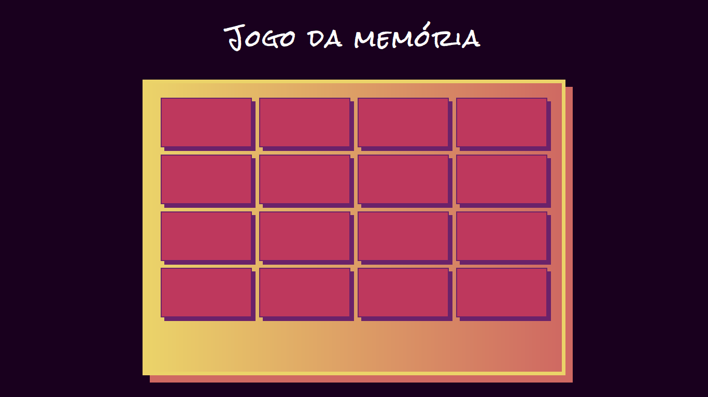
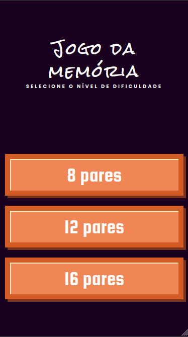
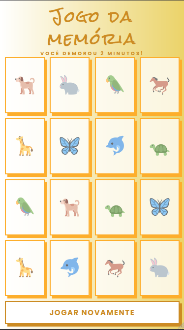
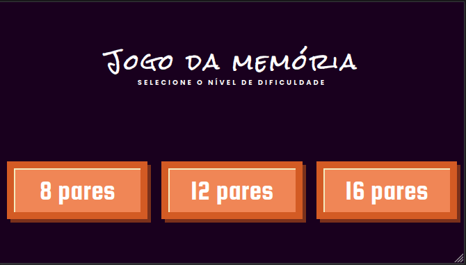
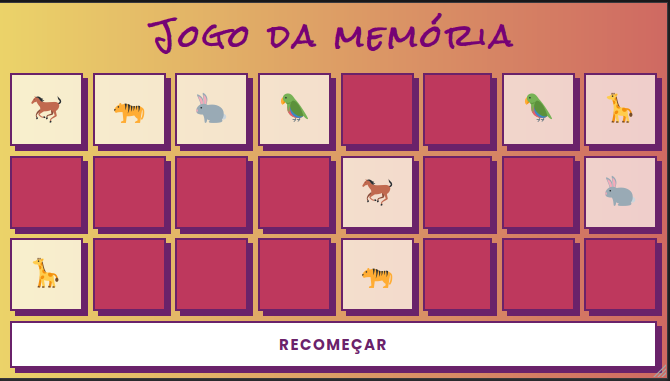
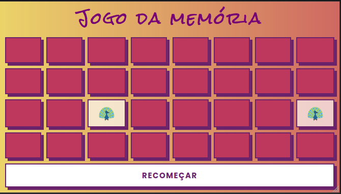

# :video_game: Jogo da memória

Um jogo da memória de emojis de animais é apresentado neste projeto. Seu objetivo é a descoberta de pares correspondentes, selecionando duas cartas por vez. Estão disponíveis três níveis de dificuldade: 8, 12 e 16 pares. Após a descoberta de todos os emojis o jogo acaba informando o tempo que o jogador demorou para concluí-lo.

Utilizando JavaScript puro são explorados conceitos como manipulação de DOM, uso de eventos e efeitos de estilização. Este é um desafio de projeto da Digital Innovation One.

## :gear: Tecnologias

- HTML
- CSS
- JavaScript

## :art: Layout

